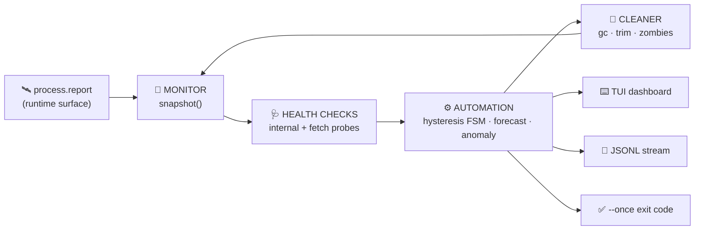

<div align="center">


# 🛰️ SENTINEL

### *A real-time system monitor that talks to the runtime directly — zero imports, zero dependencies, zero build tools.*

A **system health sentinel** in **TypeScript** that monitors your machine, runs health checks, automates incident response, and cleans up after itself — written with **no `import`, no libraries, and no build step**. Built for the **Code Olympics 2026** hackathon.

<br/>

<!-- language / runtime -->


<!-- constraint scoreboard -->


**[✨ Features](#-features) • [🧠 How It Works](#-how-it-works) • [🚀 Quick Start](#-quick-start) • [🎬 Usage](#-usage) • [🏗️ Architecture](#️-architecture) • [🏆 Rubric](#-how-it-scores)**

</div>

---

## 🎯 The one-sentence pitch

> Most "no-library" entries quietly `import { cpus } from "node:os"`. **SENTINEL imports nothing at all** — it reads per-core CPU, system memory, the V8 heap limit and the live handle table straight out of the Node runtime via `process.report`, then forecasts failures with hand-rolled math. One file. No `node_modules`. No compiler.

---

## 🚨 The constraint, taken to the extreme

The challenge says **"No-Import Rookie — only built-in functions, no libraries."** Here's how far most people take it vs. how far SENTINEL takes it:

| | 😐 Typical reading | ✅ SENTINEL |
|---|---|---|
| npm packages | none | none |
| Node core modules (`node:os`, `node:fs`) | freely imported | **never imported** |
| `import` / `require` statements | a handful | **exactly 0** |
| Type packages (`@types/node`) | installed | **hand-authored ambient types instead** |
| Build / compile step | `tsc` → `.js` | **none — Node strips types in memory** |
| How it gets system metrics | OS module | **`process.report` runtime surface** |

The result satisfies *any* reading of "no libraries" — and turns the constraint into the most interesting part of the project.

---

## ✨ Features

SENTINEL fuses **all four** System-Utilities domains — *monitor · health-checks · automation · cleaner* — into one cohesive pipeline, then adds three things that make it more than a pretty `htop`.

### 📡 What it monitors *(all zero-import)*

| | Signal | Source |
|:--:|---|---|
| 🟢 | **Per-core + aggregate CPU %** | `process.report` → `header.cpus` time deltas |
| 🔵 | **System memory %** (used / total) | `process.report` → `resourceUsage` |
| 🟣 | **V8 heap pressure** (used / limit) | `process.report` → `javascriptHeap` |
| 🟠 | **Event-loop lag** | timer drift via `performance.now()` |
| 🔴 | **Libuv handles + "zombies"** | `process.report` → `libuv` (active **and** unreferenced) |
| 🌐 | **HTTP endpoint health** | global `fetch` + `AbortController` timeout |

### 🧠 What makes it smart *(pure math, no libraries)*

| | Capability | How |
|:--:|---|---|
| 🔮 | **Failure forecasting** | Least-squares regression over each metric's history → *"heap +6.2%/min → crit in ~4m10s."* |
| ✶ | **Adaptive anomaly detection** | EWMA mean/variance (Welford) baseline flags any metric **> 3σ** — *no hand-set thresholds.* |
| ♻️ | **No-flap incident engine** | Hysteresis + debounce FSM with an `OPEN → RESOLVED` lifecycle and duration (MTTR). Alerts never chatter. |
| 🧹 | **Inward cleaner** | No `fs` allowed → it cleans its *own* footprint: GC under pressure, history-buffer trim, zombie-handle reporting. |

---

## 🧠 How It Works



1. **📡 Sample** — `process.report.getReport()` is read once per interval as an in-memory snapshot (no file written).
2. **🩺 Check** — internal thresholds + optional HTTP probes produce a weighted **health score + A–F grade**.
3. **⚙️ Automate** — each metric runs through a hysteresis/debounce state machine; breaches become tracked incidents; trends are forecast; outliers are flagged.
4. **🧹 Clean** — the daemon trims its own history and (with `--expose-gc`) reclaims heap, then reports leaked handles.
5. **🎨 Render** — the same data feeds the live TUI, a JSONL stream, or a one-shot CI report.

### 🆓 Why zero-import (it's a feature, not a stunt)

A self-contained, dependency-free utility is **reproducible** (no lockfile drift), **auditable** (every byte it runs is in one file), **instant** (no `npm install`, no build), and **portable** (runs on any Node 22+ host, Windows/Linux/macOS, identically). The `process.report` approach proves you can build a real system tool without reaching for a single library.

---

## 🚀 Quick Start

> **Prerequisites:** **Node.js 22+** only. No install, no `npm i`, no compiler, no `node_modules`.

### 🪟 Windows (PowerShell)

```powershell
# Live dashboard
node --no-warnings --experimental-strip-types sentinel.ts

# Or run the guided demo (proof → tests → report → live TUI under CPU load)
powershell -ExecutionPolicy Bypass -File .\demo.ps1
```

### 🐧 macOS / Linux

```bash
node --no-warnings --experimental-strip-types sentinel.ts
```

That's the whole setup. The `--experimental-strip-types` flag tells Node to erase the TypeScript types in memory and run the file directly.

---

## 🎬 Usage

| Command | What it does |
|---|---|
| `… sentinel.ts` | ⌨️ **Live TUI** — colored dashboard, redraws each interval |
| `… sentinel.ts --once` | ✅ **One-shot report** — exits `0`=ok `1`=warn `2`=crit (drop-in CI / cron gate) |
| `… sentinel.ts --json` | 📜 **Headless daemon** — JSONL metrics + events for pipelines |
| `… sentinel.ts --selftest` | 🧪 **Built-in tests** — 15 assertions, no test framework, exits `0` on pass |
| `… sentinel.ts --check <url>` | 🌐 Add an HTTP(S) health target (repeatable) |
| `… sentinel.ts --interval <ms>` | ⏱️ Sample interval (default 1000) |
| `… sentinel.ts --help` | ❓ Full option list |

*(prefix every command with `node --no-warnings --experimental-strip-types`)*

### 🌐 Live health-check (verified against the real internet)

```text
CHECKS
  OK    https://example.com        HTTP 200 in 229ms
  OK    https://api.github.com     HTTP 200 in  98ms
  CRIT  https://bad-host.invalid   unreachable (TypeError)
HEALTH  C  72/100  CRIT     →  process exit code 2
```

One failing endpoint drags the aggregate to **CRIT** and the process exits `2` — exactly what a CI pipeline needs.

---

## 🏗️ Architecture

One file, ten clearly-sectioned subsystems. Logic lives in **pure functions**; all I/O is isolated; the type system *is* the architecture.

<details>
<summary><b>📁 File layout (sections of <code>sentinel.ts</code>)</b></summary>

```
sentinel.ts  (605 lines)
├─ 1  Ambient runtime types   hand-rolled `declare const process` (no @types/node)
├─ 2  Domain types            branded units (Pct·Bytes·Ms), discriminated-union events
├─ 3  Utility layer           slope · EWMA(Welford) · ANSI · bars · sparkline · Ring buffer
├─ 4  MONITOR                 snapshot() — reads the process.report surface
├─ 5  HEALTH CHECKS           internal thresholds + fetch probes + weighted score
├─ 6  AUTOMATION              hysteresis/debounce FSM · forecasting · anomaly detection
├─ 7  CLEANER (inward)        gc trigger · history trim · zombie-handle reporting
├─ 8  RENDERER                TUI frame · one-shot report · JSONL line
├─ 9  MAIN                    CLI parsing · modes · SIGINT restore · exit codes
└─ 10 SELFTEST                zero-import assertions on every pure function
```
</details>

<details>
<summary><b>🧬 TypeScript discipline on display</b></summary>

| Technique | Where |
|---|---|
| **Branded unit types** (`Pct`, `Bytes`, `Ms`) | prevent mixing a percentage with a byte count at compile time |
| **Discriminated unions** (`SentinelEvent`) | exhaustively handled with a `never` guard |
| **`as const` status unions** | `OK / WARN / CRIT` without `enum` (erasable-syntax-only) |
| **Generics** (`Ring<T>`) | typed fixed-capacity history buffer |
| **`--noUncheckedIndexedAccess`** | every array access is null-checked |
| **Self-authored ambient types** | strict `tsc` passes with **no `@types/node` installed** |

</details>

<details>
<summary><b>🧰 "Tech stack"</b></summary>

| Layer | Choice |
|---|---|
| Language | TypeScript (strict, erasable-syntax-only) |
| Runtime | Node.js 22 native type-stripping |
| Metrics source | `process.report`, `process.memoryUsage`, `performance` |
| Networking | global `fetch` + `AbortController` |
| **Dependencies** | **none** |
| **Build tooling** | **none** |

</details>

---

## 🏆 How It Scores

Mapped to the official judging rubric:

| Weight | Criterion | How SENTINEL earns it |
|:--:|---|---|
| **30%** | Functionality & Reliability | Real metrics, 4 modes, CI exit codes, no-flap alerting, 15 passing self-tests, verified live HTTP checks |
| **25%** | Constraint Mastery | Stricter than required — 0 imports, 0 deps, 0 build, self-authored types |
| **20%** | Language Adaptation | Branded types, discriminated unions, erasable-only strict TS — types as architecture |
| **15%** | Code Quality | Pure functions, isolated I/O, one section per concern, well under budget |
| **10%** | Innovation | `process.report` as a metrics surface · failure forecasting · anomaly detection · inward cleaner |

### ✅ Constraints — verified

| Constraint | Target | Actual |
|---|---|:--:|
| No-Import Rookie | no libraries | **0 import/require statements** |
| Enterprise Creator | ≤ 650 lines | **605 lines** |
| System Utilities | the 4 domains | **monitor · health · automation · cleaner** |
| TypeScript | type discipline | **`tsc --strict --noEmit` → 0 errors** |

```text
Reproduce →  node --no-warnings --experimental-strip-types sentinel.ts --selftest      # 15/15
             npx -y typescript tsc --strict --noEmit --erasableSyntaxOnly sentinel.ts  # 0 errors
```

---

## ⚠️ Honest limitations

<details>
<summary><b>We'd rather be precise than oversell</b></summary>

- **`--expose-gc` needed for the GC cleaner.** Without it, the cleaner degrades gracefully to history-trim + zombie reporting (no crash, just one fewer action).
- **Health checks are HTTP(S) only.** `fetch` doesn't speak `file://` — correct scope for "health checks," but not a port scanner.
- **First frame shows 0% CPU.** Per-core utilization needs two samples to diff; it's accurate from the second tick on.
- **`process.report` is the dependency-free trade-off.** It's a rich snapshot but a slightly heavier call than a raw syscall — mitigated by sampling once per interval and never retaining the object.

</details>

---

<div align="center">

---

### *A real system tool, built with nothing but the language and the runtime.* 🛰️

Built for **Code Olympics 2026** · No-Import Rookie · Enterprise Creator · System Utilities · TypeScript

</div>
