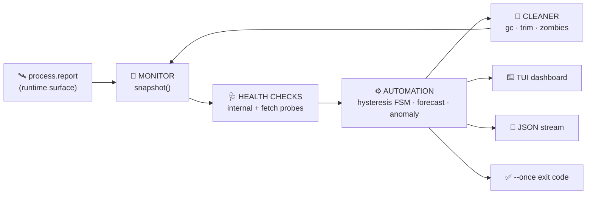

<div align="center">



# 🛰️ SENTINEL

### *A real-time system health monitor that talks to the runtime directly — zero imports, zero dependencies, zero build tools.*

A **system health sentinel** written in **TypeScript** that monitors your machine, runs health checks, automates incident response, and manages its own footprint — built with **no `import`, no libraries, and no build step**. Created for the **Code Olympics 2026** hackathon.

<br/>

<!-- language / runtime -->


<!-- constraint scoreboard -->


**[Features](#-features) • [How It Works](#-how-it-works) • [Quick Start](#-quick-start) • [Usage](#-usage) • [Architecture](#️-architecture) • [Verification](#-verification)**

</div>

---

## Overview

SENTINEL is a self-contained system-monitoring daemon that reads per-core CPU, system memory, the V8 heap limit, and the live handle table **directly from the Node.js runtime** via `process.report` — without importing a single library or core module. On top of those raw metrics it layers failure forecasting, adaptive anomaly detection, and a no-flap incident engine, then renders everything to a live terminal dashboard, a JSON stream, or a CI-ready exit code.

The result is a genuinely useful operations tool delivered as **one file, with no `node_modules` and no compiler** — proof that a real system utility can be built with nothing but the language and the runtime.

---

## The constraint, applied rigorously

The challenge specifies **"No-Import Rookie — only built-in functions, no libraries."** SENTINEL adopts the strictest possible interpretation:

| | Common interpretation | SENTINEL |
|---|---|---|
| npm packages | none | none |
| Node core modules (`node:os`, `node:fs`) | freely imported | **never imported** |
| `import` / `require` statements | a handful | **exactly 0** |
| Type packages (`@types/node`) | installed | **hand-authored ambient types** |
| Build / compile step | `tsc` → `.js` | **none — Node strips types in memory** |
| System-metrics source | OS module | **`process.report` runtime surface** |

This satisfies every reading of "no libraries" — and turns the constraint into the defining feature of the project.

---

## ✨ Features

SENTINEL unifies **all four** System-Utilities domains — *monitor · health-checks · automation · cleaner* — into a single cohesive pipeline, then adds the analytics that distinguish it from a conventional process monitor.

### What it monitors *(all zero-import)*

| | Signal | Source |
|:--:|---|---|
| 🟢 | **Per-core + aggregate CPU %** | `process.report` → `header.cpus` time deltas |
| 🔵 | **System memory %** (used / total) | `process.report` → `resourceUsage` |
| 🟣 | **V8 heap pressure** (used / limit) | `process.report` → `javascriptHeap` |
| 🟠 | **Event-loop lag** | timer drift via `performance.now()` |
| 🔴 | **Libuv handles + zombies** | `process.report` → `libuv` (active **and** unreferenced) |
| 🌐 | **HTTP endpoint health** | global `fetch` + `AbortController` timeout |

### What makes it intelligent *(pure math, no libraries)*

| | Capability | Approach |
|:--:|---|---|
| 🔮 | **Failure forecasting** | Least-squares regression over each metric's history projects time-to-threshold — *"heap +6.2%/min → critical in ~4m10s."* |
| ✶ | **Adaptive anomaly detection** | An EWMA mean/variance (Welford) baseline flags any metric beyond **3σ** — no hand-set thresholds. |
| ♻️ | **No-flap incident engine** | A hysteresis + debounce state machine with an `OPEN → RESOLVED` lifecycle and measured duration (MTTR). Alerts never chatter. |
| 🧹 | **Self-managing cleaner** | Triggers garbage collection under heap pressure, trims its own history buffers, and reports leaked handles — a monitor accountable for its own footprint. |

---

## 🧠 How It Works



1. **Sample** — `process.report.getReport()` is read once per interval as an in-memory snapshot (no file is written).
2. **Check** — internal thresholds and optional HTTP probes produce a weighted **health score and A–F grade**.
3. **Automate** — each metric passes through a hysteresis/debounce state machine; sustained breaches become tracked incidents; trends are forecast; outliers are flagged.
4. **Clean** — the daemon trims its own history and (with `--expose-gc`) reclaims heap, then reports leaked handles.
5. **Render** — the same data feeds the live TUI, a JSON stream, or a one-shot CI report.

### Why zero-import matters

A dependency-free utility is **reproducible** (no lockfile drift), **auditable** (every byte it runs lives in one file), **instant** (no install, no build), and **portable** (runs identically on any Node 22+ host across Windows, Linux, and macOS). The `process.report` approach demonstrates that a complete system tool can be built without a single external dependency.

---

## 🚀 Quick Start

> **Prerequisites:** **Node.js 22+** only — no install, no `npm i`, no compiler, no `node_modules`. Verify your version with `node --version`.

### Windows (PowerShell)

```powershell
node --no-warnings --experimental-strip-types sentinel.ts
```

### macOS / Linux

```bash
node --no-warnings --experimental-strip-types sentinel.ts
```

The `--experimental-strip-types` flag instructs Node to erase the TypeScript annotations in memory and execute the file directly. That is the entire setup.

---

## 🎬 Usage

All commands are prefixed with `node --no-warnings --experimental-strip-types`.

| Command | Description |
|---|---|
| `sentinel.ts` | **Live TUI** — colored dashboard that redraws each interval |
| `sentinel.ts --once` | **One-shot report** — exits `0`=ok, `1`=warn, `2`=crit (drop-in CI / cron gate) |
| `sentinel.ts --json` | **Headless daemon** — JSON metrics + events for pipelines |
| `sentinel.ts --selftest` | **Built-in tests** — 17 assertions, no test framework, exits `0` on pass |
| `sentinel.ts --check <url>` | Add an HTTP(S) health target (repeatable) |
| `sentinel.ts --interval <ms>` | Sample interval (default `1000`) |
| `sentinel.ts --help` | Full option list |

### Live health-check example

```text
CHECKS
  OK    https://example.com        HTTP 200 in 229ms
  OK    https://api.github.com     HTTP 200 in  98ms
  CRIT  https://bad-host.invalid   unreachable (TypeError)
HEALTH  C  72/100  CRIT     →  process exit code 2
```

A single failing endpoint drives the aggregate status to **CRIT** and the process exits `2` — exactly the signal a CI pipeline requires.

---

## 🏗️ Architecture

One file, ten clearly delineated subsystems. Business logic is written as **pure functions**, all I/O is isolated, and the type system encodes the architecture.

<details>
<summary><b>File layout (sections of <code>sentinel.ts</code>)</b></summary>

```
sentinel.ts  (605 lines)
├─ 1  Ambient runtime types   hand-authored `declare const process` (no @types/node)
├─ 2  Domain types            branded units (Pct·Bytes·Ms), discriminated-union events
├─ 3  Utility layer           slope · EWMA(Welford) · ANSI · bars · sparkline · Ring buffer
├─ 4  MONITOR                 snapshot() — reads the process.report surface
├─ 5  HEALTH CHECKS           internal thresholds + fetch probes + weighted score
├─ 6  AUTOMATION              hysteresis/debounce FSM · forecasting · anomaly detection
├─ 7  CLEANER                 gc trigger · history trim · zombie-handle reporting
├─ 8  RENDERER                TUI frame · one-shot report · JSON line
├─ 9  MAIN                    CLI parsing · modes · SIGINT restore · exit codes
└─ 10 SELFTEST                zero-import assertions on every pure function
```
</details>

<details>
<summary><b>TypeScript discipline</b></summary>

| Technique | Purpose |
|---|---|
| **Branded unit types** (`Pct`, `Bytes`, `Ms`) | prevent mixing a percentage with a byte count at compile time |
| **Discriminated unions** (`SentinelEvent`) | exhaustively handled with a `never` guard |
| **`as const` status unions** | `OK / WARN / CRIT` without `enum` (erasable-syntax-only) |
| **Generics** (`Ring<T>`) | typed fixed-capacity history buffer |
| **`--noUncheckedIndexedAccess`** | every array access is null-checked |
| **Self-authored ambient types** | strict `tsc` passes with no `@types/node` installed |

</details>

<details>
<summary><b>Technology</b></summary>

| Layer | Choice |
|---|---|
| Language | TypeScript (strict, erasable-syntax-only) |
| Runtime | Node.js 22 native type-stripping |
| Metrics source | `process.report`, `process.memoryUsage`, `performance` |
| Networking | global `fetch` + `AbortController` |
| Dependencies | none |
| Build tooling | none |

</details>

---

## 🏆 How It Scores

Mapped to the official judging rubric:

| Weight | Criterion | How SENTINEL earns it |
|:--:|---|---|
| **30%** | Functionality & Reliability | Real metrics, four modes, CI exit codes, no-flap alerting, 17 passing self-tests, verified live HTTP checks |
| **25%** | Constraint Mastery | Stricter than required — 0 imports, 0 dependencies, 0 build step, self-authored types |
| **20%** | Language Adaptation | Branded types, discriminated unions, erasable-only strict TS — types as architecture |
| **15%** | Code Quality | Pure functions, isolated I/O, one section per concern, comfortably within budget |
| **10%** | Innovation | `process.report` as a metrics surface · failure forecasting · anomaly detection · self-managing cleaner |

---

## ✅ Verification

Every constraint is independently verifiable in seconds.

| Constraint | Target | Result |
|---|---|:--:|
| No-Import Rookie | no libraries | **0 import/require statements** |
| Enterprise Creator | ≤ 650 lines | **605 lines** |
| System Utilities | the four domains | **monitor · health · automation · cleaner** |
| TypeScript | type discipline | **`tsc --strict --noEmit` → 0 errors** |

```text
# zero imports (no output = pass)
Select-String -Path sentinel.ts -Pattern '^\s*(import|require)\b'

# line count
(Get-Content sentinel.ts).Count

# built-in test suite  →  17 passed, 0 failed
node --no-warnings --experimental-strip-types sentinel.ts --selftest

# strict type-check  →  0 errors
npx -y typescript tsc --strict --noEmit --erasableSyntaxOnly sentinel.ts
```

---

<div align="center">

### *A real system tool, built with nothing but the language and the runtime.* 🛰️

Built for **Code Olympics 2026** · No-Import Rookie · Enterprise Creator · System Utilities · TypeScript

</div>
